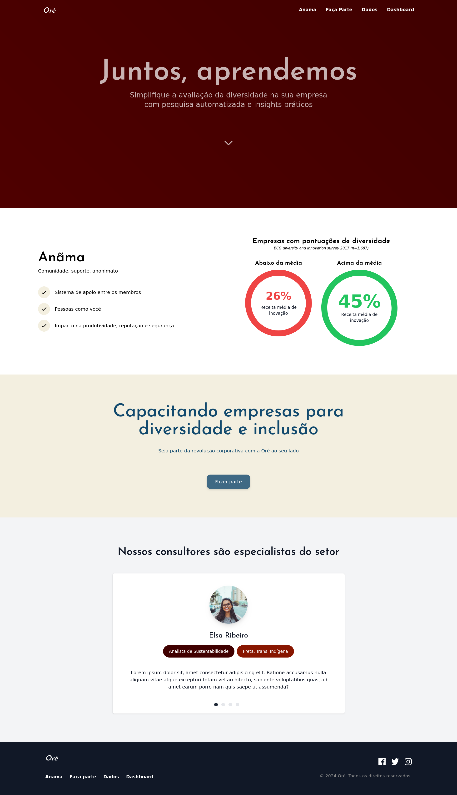

# Hacka4all - Oré

## Sumário

- [Geral](#geral)
  - [Desafio](#desafio)
  - [Objetivo](#objetivo)
  - [Screenshot](#screenshot)
  - [Link](#link)
  - [Feito com](#feito-com)
- [Executando o projeto localmente](#executando-o-projeto-localmente)
- [Equipe](#equipe)

## Geral

### Desafio

Falta de conscientização e capacitação sobre inclusão e diversidade nas empresas

### Objetivo

O projeto tem como objetivo propor um diagnóstico empresarial, oferecer cursos de capacitação, realizar eventos sobre análise de casos e criar um espaço de apoio emocional para diversos colaboradores.

### Screenshot



### Link

- [Site](https://develis.github.io/hacka4all/)

### Feito com

- Vue.js
- TailwindCSS
- CSS
- Flexbox

## Executando o projeto localmente

#### Instruções de instalação

Certifique-se de ter o Yarn instalado em sua máquina:

```bash
npm install --global yarn
```

Clone o projeto do repositório do Github:

```bash
# Para conexões https:
git clone https://github.com/develis/hacka4all.git

# Para conexões ssh:
git clone git@github.com:develis/hacka4all.git
```

Após concluir o clone do projeto, instale as dependências e o node_modules:

```bash
yarn install
```

Para executar o projeto localmente:

```bash
yarn dev
```

Para visualizá-lo, abra o navegador e digite: `localhost:5173/`. A numeração da porta pode variar dependendo da sua rede.


## Equipe

**Soulvers**
- Elis
- Ilá
- Jamilson
- Makal
- Monique
- Victor
